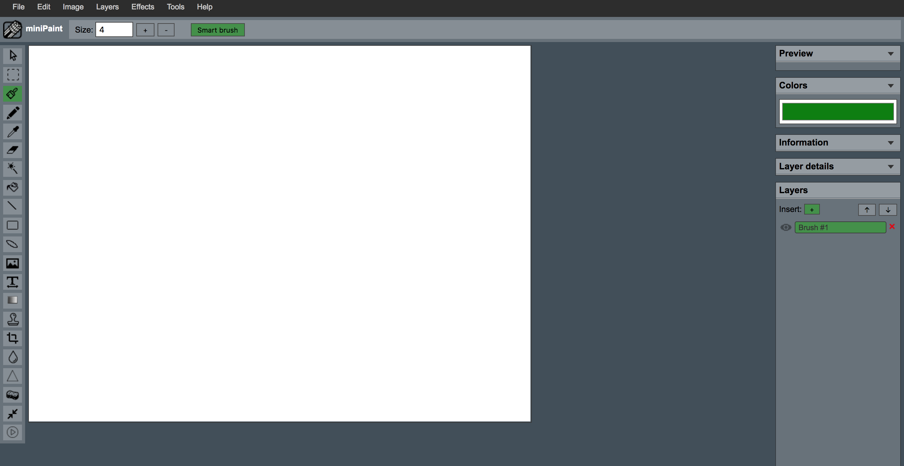

# Minipaint based on Fabric.js Editor

A 100% web-based vector image editor that uses the HTML5 canvas element and [Fabric.js](http://fabricjs.com/)

## Run

Open src/index.html file.

## Screenshots

## License

MIT License

Copyright (c) 2017 Daniel Taylor

